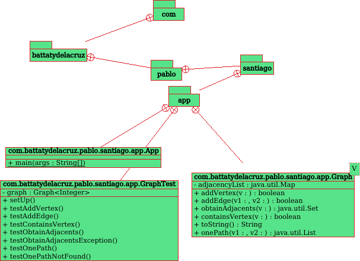

# BÚSQUEDA DE UN CAMINO EN UN GRAFO

## Breve descripción de la aplicación

* Resumen: el software que se publica en este repositorio permite
  implementar una estructura de datos de grafo mediante desarrollo dirigido por pruebas
* Versión: 1.0.

## Compilación del programa y ejecución de los tests

Se ha realizado mediante `Maven` que define, entre otras tareas, el desarrollo dirigido por pruebas:

```console
mvn test
```

## Cómo limpiar el repositorio

El repositorio se puede limpiar mediante el siguiente comando:

```console
mvn test
```

## Estructura del código

Tal y como muestra la siguiente figura


existen tres clases: `App.java` y `Graph.java`, en el paquete `main`; y `GraphTest.java`, en el
paquete `test`, que realiza los tests correspondientes.

## Copyright

Copyright [2023] [Pablo de la Cruz y Santiago Battat]
Licensed under the Apache License, Version 2.0 (the "License");
you may not use this file except in compliance with the License.
You may obtain a copy of the License at
http://www.apache.org/licenses/LICENSE-2.0
Unless required by applicable law or agreed to in writing,
software distributed under the License is distributed on an
"AS IS" BASIS, WITHOUT WARRANTIES OR CONDITIONS OF ANY KIND,
either express or implied. See the License for the specific
language governing permissions and limitations under the
License.